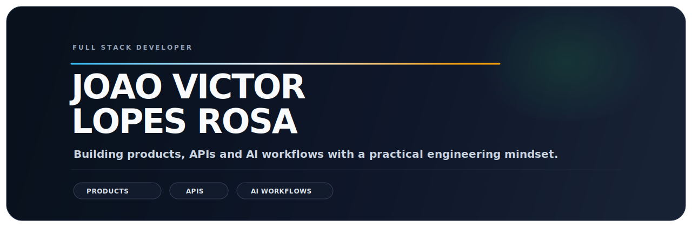
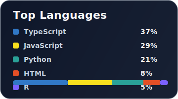

<h1 align="center">João Victor Lopes Rosa</h1>

<p align="center">
  <strong>Full Stack Developer</strong> building internal platforms, product systems and software architecture from Jacareí-SP.
</p>

<p align="center">
  
</p>

<p align="center">
  <a href="https://git.io/typing-svg">
    
  </a>
</p>

<p align="center">
  <a href="mailto:joaovlr9@gmail.com">📧 Email</a>
  ·
  <a href="https://www.linkedin.com/in/jv-l0pes/">💼 LinkedIn</a>
  ·
  <a href="https://jv-l0pes-porfolio-7d66.vercel.app/">🌐 Portfolio</a>
  ·
  <a href="https://github.com/JV-L0pes?tab=followers">👥 Followers</a>
</p>

<p align="center">
  <a href="#pt-br">🇧🇷 PT-BR</a> · <a href="#en">🇺🇸 EN</a>
</p>

<h2 id="pt-br">PT-BR</h2>

```ts
const joao = {
  cargo: "Desenvolvedor Full Stack",
  localizacao: "Jacarei-SP, Brasil",
  atual: "Desenvolvedor Full Stack @ AutoU, atuando no aura-central-autou",
  formacao: "DSM na FATEC Jacarei (2025-2027)",
  foco: [
    "React + TypeScript",
    "FastAPI + NestJS",
    "DDD + monolito modular",
    "ADRs e decisoes arquiteturais",
    "LLM aplicado em produto (structured outputs)",
  ],
};
```

## O Que Eu Construo

<table>
  <tr>
    <td width="33%" valign="top">
      <h3>Interfaces de Produto</h3>
      <p>Aplicacoes web com React, Next.js, TypeScript e Tailwind, pensadas para clareza, performance e evolucao de design system.</p>
    </td>
    <td width="33%" valign="top">
      <h3>APIs e Plataformas Internas</h3>
      <p>Backends em Node.js e FastAPI com foco em boas fronteiras, APIs RESTful e pipelines de qualidade prontos para ambiente real.</p>
    </td>
    <td width="33%" valign="top">
      <h3>Arquitetura de Software</h3>
      <p>Decomposicao de dominios, monolito modular, ADRs, RBAC no backend e decisoes tecnicas com impacto em produto real.</p>
    </td>
  </tr>
</table>

## Agora

- Construindo [`aura-central-autou`](https://github.com/appautou/aura-central-autou) na `appautou` como **principal desenvolvedor do Aura**.
- Trabalhando com React, TypeScript, FastAPI, NestJS, Azure AD, Jira e DDD em produto interno em producao.
- Documentando decisoes com ADRs e evoluindo arquitetura orientada a dominios.
- Cursando DSM na FATEC Jacarei e atuando em projetos ABP em paralelo.

## Destaques

<table>
  <tr>
    <td width="50%" valign="top">
      <h3><a href="https://github.com/appautou/aura-central-autou">aura-central-autou</a></h3>
      <p>Meu principal portfolio de trabalho: monorepo privado com fluxos de projetos, CRM, recrutamento, identidade e desempenho.</p>
      <p><strong>Stack:</strong> React, TypeScript, Node.js, Python, FastAPI, PostgreSQL, Azure AD, Jira</p>
    </td>
    <td width="50%" valign="top">
      <h3><a href="https://github.com/JV-L0pes/Inbox-Copilot">Inbox-Copilot</a></h3>
      <p>Triagem de emails com IA, upload de arquivos, sugestoes automaticas e historico de analises.</p>
      <p><strong>Stack:</strong> Next.js, TypeScript, Python, FastAPI, OpenAI</p>
    </td>
  </tr>
  <tr>
    <td width="50%" valign="top">
      <h3><a href="https://github.com/JV-L0pes/sql-to-diagram">sql-to-diagram</a></h3>
      <p>Converte scripts SQL em diagramas ER visuais para iteracao rapida.</p>
      <p><strong>Stack:</strong> Next.js, TypeScript, Tailwind CSS</p>
    </td>
    <td width="50%" valign="top">
      <h3><a href="https://github.com/ArchFlowPlatform/ArchFlow">ArchFlow MVP</a></h3>
      <p>Gestao agil orientada a arquitetura: ADRs, C4, ERD com geracao de SQL/migrations e rastreabilidade do requisito ao deploy.</p>
      <p><strong>Stack:</strong> .NET, Next.js, TypeScript, PostgreSQL</p>
    </td>
  </tr>
</table>

## Como Eu Trabalho

- Penso em produto, nao so em feature.
- Gosto de codigo com fronteiras claras, qualidade automatizada e stack que aguenta crescer.
- Boa parte do meu trabalho mais forte esta em repositorios privados, entao aqui eu mostro contexto tecnico e projetos publicos complementares.

<h2 id="en">EN</h2>

```ts
const joao = {
  role: "Full Stack Developer",
  location: "Jacarei-SP, Brazil",
  current: "Full Stack Developer @ AutoU, building aura-central-autou",
  education: "DSM @ FATEC Jacarei (2025-2027)",
  focus: [
    "React + TypeScript",
    "FastAPI + NestJS",
    "DDD + modular monolith",
    "ADRs and architecture decisions",
    "Applied LLM in product (structured outputs)",
  ],
};
```

## What I Build

<table>
  <tr>
    <td width="33%" valign="top">
      <h3>Product Interfaces</h3>
      <p>Web apps with React, Next.js, TypeScript and Tailwind, built for clarity, performance and maintainable component systems.</p>
    </td>
    <td width="33%" valign="top">
      <h3>APIs and Internal Platforms</h3>
      <p>Backends in Node.js and FastAPI with a strong bias toward clean boundaries, RESTful APIs and production-ready quality gates.</p>
    </td>
    <td width="33%" valign="top">
      <h3>Software Architecture</h3>
      <p>Domain decomposition, modular monoliths, ADRs, backend RBAC, and technical decisions that affect real product delivery.</p>
    </td>
  </tr>
</table>

## Now

- Building [`aura-central-autou`](https://github.com/appautou/aura-central-autou) inside `appautou` as **lead developer on Aura**.
- Working with React, TypeScript, FastAPI, NestJS, Azure AD, Jira, and DDD in a production internal platform.
- Documenting decisions with ADRs and evolving a domain-oriented architecture.
- Studying DSM at FATEC Jacarei while shipping ABP projects on the side.

## Highlights

<table>
  <tr>
    <td width="50%" valign="top">
      <h3><a href="https://github.com/appautou/aura-central-autou">aura-central-autou</a></h3>
      <p>My main professional portfolio piece: a private monorepo covering projects, CRM, recruiting, identity and performance flows.</p>
      <p><strong>Stack:</strong> React, TypeScript, Node.js, Python, FastAPI, PostgreSQL, Azure AD, Jira</p>
    </td>
    <td width="50%" valign="top">
      <h3><a href="https://github.com/JV-L0pes/Inbox-Copilot">Inbox-Copilot</a></h3>
      <p>AI-assisted email triage with file upload, automatic suggestions and analysis history.</p>
      <p><strong>Stack:</strong> Next.js, TypeScript, Python, FastAPI, OpenAI</p>
    </td>
  </tr>
  <tr>
    <td width="50%" valign="top">
      <h3><a href="https://github.com/JV-L0pes/sql-to-diagram">sql-to-diagram</a></h3>
      <p>Turns SQL scripts into visual ER diagrams for fast iteration.</p>
      <p><strong>Stack:</strong> Next.js, TypeScript, Tailwind CSS</p>
    </td>
    <td width="50%" valign="top">
      <h3><a href="https://github.com/ArchFlowPlatform/ArchFlow">ArchFlow MVP</a></h3>
      <p>Architecture-first agile product: ADRs, C4 diagrams, ERD with SQL/migration generation, and end-to-end traceability.</p>
      <p><strong>Stack:</strong> .NET, Next.js, TypeScript, PostgreSQL</p>
    </td>
  </tr>
</table>

## How I Work

- I care about product, not just isolated features.
- I like clear boundaries, automated quality and stacks that can grow without collapsing.
- A meaningful part of my best work lives in private repositories, so this profile focuses on technical context plus complementary public projects.

## Tech Radar / Radar Tecnico

<p>
  
  
  
  
  
  
  
  
  
  
  
</p>

## GitHub Pulse

<p align="center">
  
  
</p>

<p align="center">
  <picture>
    <source media="(prefers-color-scheme: dark)" srcset="https://raw.githubusercontent.com/JV-L0pes/JV-L0pes/output/github-contribution-grid-snake-dark.svg" />
    <source media="(prefers-color-scheme: light)" srcset="https://raw.githubusercontent.com/JV-L0pes/JV-L0pes/output/github-contribution-grid-snake.svg" />
    
  </picture>
</p>

## Contact / Contato

<p align="center">
  If you're building useful products, internal platforms or domain-oriented systems, let's talk.
  <br />
  Se voce estiver construindo produtos uteis, plataformas internas ou sistemas orientados a dominio, vamos conversar.
</p>
