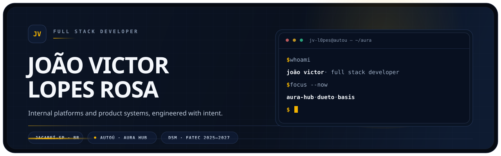

  <a href="#pt-br">PT-BR</a> · <a href="#en">EN</a>

<h2 id="pt-br">PT-BR</h2>

## Sobre

Desenvolvedor full stack na **AutoU**, onde construo o ecossistema **Aura Hub** — portal, timesheet, projetos, CRM, recrutamento, notificações, permissões e suporte — como principal desenvolvedor do Aura. Fora do trabalho, desenvolvo o **Dueto**, uma agenda compartilhada para Android, e o **Basis**, uma plataforma de gestão de investimentos.

Gosto de produto, fronteiras claras entre domínios e qualidade automatizada. Decisões de arquitetura ficam registradas em ADRs, e o padrão de entrega é fatia vertical: comportamento, autorização, testes, lint e documentação juntos.

## Trabalho @ AutoU

<table>
  <tr>
    <td width="100%" valign="top">
      <h3><a href="https://github.com/appautou">Aura Hub</a> <em>· ecossistema privado</em></h3>
      
Meu principal portfólio de trabalho: plataforma interna com portal e SSO Microsoft, timesheet, projetos, CRM, recrutamento, feedback, notificações, autorização e suporte, distribuídos em serviços independentes. Atuo como <strong>principal desenvolvedor do Aura</strong>.

      
<strong>Repositórios:</strong> <code>aura-backend</code> · <code>aura-frontend</code> · <code>aura-crm-backend</code> · <code>aura-permissions</code> · <code>aura-notifications</code> · <code>aura-modulo-suporte-backend</code>

      
<strong>Stack:</strong> React · TypeScript · Vite · Python · FastAPI · PostgreSQL · Azure AD (MSAL) · Jira

    </td>
  </tr>
</table>

<table>
  <tr>
    <td width="50%" valign="top">
      <h3><a href="https://github.com/appautou/vitrine_autou">vitrine_autou</a> <em>· privado</em></h3>
      
Plugin do Figma que lê o componente selecionado no canvas, coleta metadados e alimenta a Vitrine de componentes do time — API Node/Express e SQLite.

      
<strong>Stack:</strong> TypeScript · Figma Plugin API · Node.js · Express · SQLite

    </td>
    <td width="50%" valign="top">
      <h3><a href="https://github.com/appautou/it-cost-manager">it-cost-manager</a> <em>· privado</em></h3>
      
Dashboard que centraliza os custos de cloud (AWS, Azure e GCP) da AutoU, com KPIs, filtros e gráficos.

      
<strong>Stack:</strong> Python · FastAPI · React 19 · Vite · Tailwind CSS · Recharts

    </td>
  </tr>
</table>

## Projetos Pessoais

<table>
  <tr>
    <td width="50%" valign="top">
      <h3><a href="https://github.com/JV-L0pes/dueto">Dueto</a> <em>· privado</em></h3>
      
Agenda compartilhada para Android: descubra quando vocês estão livres e fechem o plano sem trocar mensagens. App Expo com design system próprio e privacidade controlada por conexão.

      
<strong>Stack:</strong> React Native (Expo) · TypeScript · FastAPI · PostgreSQL

    </td>
    <td width="50%" valign="top">
      <h3><a href="https://github.com/JV-L0pes/Investment-Management-Platform">Basis</a></h3>
      
Plataforma de gestão de investimentos para o mercado brasileiro: clientes, carteiras, extrato, posições, performance, risco e dados de mercado em um monolito modular DDD com frontend próprio.

      
<strong>Stack:</strong> Python · FastAPI · SQLAlchemy · PostgreSQL · React 19 · Vite

    </td>
  </tr>
  <tr>
    <td width="50%" valign="top">
      <h3><a href="https://github.com/JV-L0pes/sprintline">Sprintline</a> · <a href="https://sprintline-web.vercel.app">live</a></h3>
      
Tracking ágil com métricas confiáveis: kanban, sprints e burndown/burnup/velocity/CFD calculados de um event log append-only, com integrações Jira e Trello.

      
<strong>Stack:</strong> FastAPI · SQLAlchemy async · PostgreSQL · React 19 · Vite

    </td>
    <td width="50%" valign="top">
      <h3><a href="https://github.com/JV-L0pes/Inbox-Copilot">Inbox-Copilot</a></h3>
      
Triagem de emails com IA, upload de arquivos, sugestões automáticas e histórico de análises.

      
<strong>Stack:</strong> Next.js · TypeScript · Python · FastAPI · OpenAI

    </td>
  </tr>
  <tr>
    <td width="50%" valign="top">
      <h3><a href="https://github.com/JV-L0pes/sql-to-diagram">sql-to-diagram</a></h3>
      
Converte scripts SQL em diagramas ER visuais para iteração rápida.

      
<strong>Stack:</strong> Next.js · TypeScript · Tailwind CSS

    </td>
    <td width="50%" valign="top">
      <h3><a href="https://github.com/JV-L0pes/warframe-arsenal-index">warframe-arsenal-index</a></h3>
      
Browser local-first do arsenal de Warframe: catálogo de mods, armas e warframes cruzado com o seu inventário, com exportação de listas em JSON. Sem contas, sem telemetria.

      
<strong>Stack:</strong> Next.js · shadcn/ui · Tailwind CSS · Python

    </td>
  </tr>
  <tr>
    <td width="50%" valign="top">
      <h3><a href="https://github.com/ArchFlowPlatform/ArchFlow">ArchFlow MVP</a></h3>
      
Gestão ágil orientada a arquitetura: ADRs, C4, ERD com geração de SQL/migrations e rastreabilidade do requisito ao deploy.

      
<strong>Stack:</strong> .NET · Next.js · TypeScript · PostgreSQL

    </td>
    <td width="50%" valign="top">
      <h3><a href="https://github.com/JV-L0pes?tab=repositories">Todos os repositórios</a></h3>
      
Experimentos, estudos e projetos menores que não cabem aqui — explore os demais repositórios públicos.

    </td>
  </tr>
</table>

## Stack

<h3 align="center">Frontend & Mobile</h3>

  
  
  
  
  
  
  

<h3 align="center">Backend & Dados</h3>

  
  
  
  
  
  

<h3 align="center">Plataforma & Ferramentas</h3>

  
  
  
  
  
  

## Trajetória

<table>
  <tr>
    <td width="18%" valign="top"><code>atual</code></td>
    <td valign="top"><strong>AutoU · Desenvolvedor Full Stack</strong> Ecossistema Aura Hub — frontend React/TypeScript, backends FastAPI/Python, SSO Microsoft, integrações Jira e arquitetura orientada a domínios.</td>
  </tr>
  <tr>
    <td width="18%" valign="top"><code>2025–2027</code></td>
    <td valign="top"><strong>FATEC Jacareí · DSM</strong> Desenvolvimento de Software Multiplataforma (cursando), com projetos ABP em equipe.</td>
  </tr>
  <tr>
    <td width="18%" valign="top"><code>contínuo</code></td>
    <td valign="top"><strong>Estudos e certificações</strong> Cursos, certificados e anotações públicas em <a href="https://github.com/JV-L0pes/Certificados">Certificados</a> · currículo em <a href="https://github.com/JV-L0pes/Curriculo">Curriculo</a>.</td>
  </tr>
</table>

## Estatísticas

  
  

  <picture>
    <source media="(prefers-color-scheme: dark)" srcset="https://raw.githubusercontent.com/JV-L0pes/JV-L0pes/output/github-contribution-grid-snake-dark.svg" />
    <source media="(prefers-color-scheme: light)" srcset="https://raw.githubusercontent.com/JV-L0pes/JV-L0pes/output/github-contribution-grid-snake.svg" />
    
  </picture>

## Contato

  Se você está construindo produtos úteis, plataformas internas ou sistemas orientados a domínio, vamos conversar.

  
  
  
  
  

<h2 id="en">EN</h2>

## About

Full stack developer at **AutoU**, building the **Aura Hub** ecosystem — portal, timesheet, projects, CRM, recruiting, notifications, permissions and support — as the lead developer on Aura. Off the clock I build **Dueto**, a shared calendar for Android, and **Basis**, an investment management platform.

I care about product, clean domain boundaries and automated quality. Architecture decisions live in ADRs, and the delivery unit is a vertical slice: behavior, authorization, tests, lint and docs together.

## Work @ AutoU

<table>
  <tr>
    <td width="100%" valign="top">
      <h3><a href="https://github.com/appautou">Aura Hub</a> <em>· private ecosystem</em></h3>
      
My main professional portfolio piece: an internal platform with portal and Microsoft SSO, timesheet, projects, CRM, recruiting, feedback, notifications, authorization and support, split across independent services. I work as the <strong>lead developer on Aura</strong>.

      
<strong>Repositories:</strong> <code>aura-backend</code> · <code>aura-frontend</code> · <code>aura-crm-backend</code> · <code>aura-permissions</code> · <code>aura-notifications</code> · <code>aura-modulo-suporte-backend</code>

      
<strong>Stack:</strong> React · TypeScript · Vite · Python · FastAPI · PostgreSQL · Azure AD (MSAL) · Jira

    </td>
  </tr>
</table>

<table>
  <tr>
    <td width="50%" valign="top">
      <h3><a href="https://github.com/appautou/vitrine_autou">vitrine_autou</a> <em>· private</em></h3>
      
Figma plugin that reads the selected component on the canvas, collects metadata and feeds the team's component showcase — Node/Express API and SQLite.

      
<strong>Stack:</strong> TypeScript · Figma Plugin API · Node.js · Express · SQLite

    </td>
    <td width="50%" valign="top">
      <h3><a href="https://github.com/appautou/it-cost-manager">it-cost-manager</a> <em>· private</em></h3>
      
Dashboard centralizing AutoU's cloud costs (AWS, Azure and GCP), with KPIs, filters and charts.

      
<strong>Stack:</strong> Python · FastAPI · React 19 · Vite · Tailwind CSS · Recharts

    </td>
  </tr>
</table>

## Personal Projects

<table>
  <tr>
    <td width="50%" valign="top">
      <h3><a href="https://github.com/JV-L0pes/dueto">Dueto</a> <em>· private</em></h3>
      
Shared calendar for Android: find out when you are both free and lock in the plan without back-and-forth messages. Expo app with its own design system and per-connection privacy.

      
<strong>Stack:</strong> React Native (Expo) · TypeScript · FastAPI · PostgreSQL

    </td>
    <td width="50%" valign="top">
      <h3><a href="https://github.com/JV-L0pes/Investment-Management-Platform">Basis</a></h3>
      
Investment management platform for the Brazilian market: clients, portfolios, transactions, positions, performance, risk and market data in a DDD modular monolith with its own frontend.

      
<strong>Stack:</strong> Python · FastAPI · SQLAlchemy · PostgreSQL · React 19 · Vite

    </td>
  </tr>
  <tr>
    <td width="50%" valign="top">
      <h3><a href="https://github.com/JV-L0pes/sprintline">Sprintline</a> · <a href="https://sprintline-web.vercel.app">live</a></h3>
      
Agile tracking with trustworthy metrics: kanban, sprints and burndown/burnup/velocity/CFD computed from an append-only event log, with Jira and Trello integrations.

      
<strong>Stack:</strong> FastAPI · SQLAlchemy async · PostgreSQL · React 19 · Vite

    </td>
    <td width="50%" valign="top">
      <h3><a href="https://github.com/JV-L0pes/Inbox-Copilot">Inbox-Copilot</a></h3>
      
AI-assisted email triage with file upload, automatic suggestions and analysis history.

      
<strong>Stack:</strong> Next.js · TypeScript · Python · FastAPI · OpenAI

    </td>
  </tr>
  <tr>
    <td width="50%" valign="top">
      <h3><a href="https://github.com/JV-L0pes/sql-to-diagram">sql-to-diagram</a></h3>
      
Turns SQL scripts into visual ER diagrams for fast iteration.

      
<strong>Stack:</strong> Next.js · TypeScript · Tailwind CSS

    </td>
    <td width="50%" valign="top">
      <h3><a href="https://github.com/JV-L0pes/warframe-arsenal-index">warframe-arsenal-index</a></h3>
      
Local-first Warframe arsenal browser: the full mod, weapon and warframe catalog cross-checked against your inventory, with JSON list exports. No accounts, no telemetry.

      
<strong>Stack:</strong> Next.js · shadcn/ui · Tailwind CSS · Python

    </td>
  </tr>
  <tr>
    <td width="50%" valign="top">
      <h3><a href="https://github.com/ArchFlowPlatform/ArchFlow">ArchFlow MVP</a></h3>
      
Architecture-first agile product: ADRs, C4 diagrams, ERD with SQL/migration generation, and end-to-end traceability.

      
<strong>Stack:</strong> .NET · Next.js · TypeScript · PostgreSQL

    </td>
    <td width="50%" valign="top">
      <h3><a href="https://github.com/JV-L0pes?tab=repositories">All repositories</a></h3>
      
Experiments, studies and smaller projects that do not fit here — take a look at the rest of my public repos.

    </td>
  </tr>
</table>

## Stack

<h3 align="center">Frontend & Mobile</h3>

  
  
  
  
  
  
  

<h3 align="center">Backend & Data</h3>

  
  
  
  
  
  

<h3 align="center">Platform & Tooling</h3>

  
  
  
  
  
  

## Background

<table>
  <tr>
    <td width="18%" valign="top"><code>now</code></td>
    <td valign="top"><strong>AutoU · Full Stack Developer</strong> Aura Hub ecosystem — React/TypeScript frontend, FastAPI/Python backends, Microsoft SSO, Jira integrations and domain-oriented architecture.</td>
  </tr>
  <tr>
    <td width="18%" valign="top"><code>2025–2027</code></td>
    <td valign="top"><strong>FATEC Jacareí · DSM</strong> Multiplatform Software Development (ongoing), with team-based ABP projects.</td>
  </tr>
  <tr>
    <td width="18%" valign="top"><code>ongoing</code></td>
    <td valign="top"><strong>Studies and certifications</strong> Courses, certificates and public notes in <a href="https://github.com/JV-L0pes/Certificados">Certificados</a> · résumé in <a href="https://github.com/JV-L0pes/Curriculo">Curriculo</a>.</td>
  </tr>
</table>

## Stats

  
  

  <picture>
    <source media="(prefers-color-scheme: dark)" srcset="https://raw.githubusercontent.com/JV-L0pes/JV-L0pes/output/github-contribution-grid-snake-dark.svg" />
    <source media="(prefers-color-scheme: light)" srcset="https://raw.githubusercontent.com/JV-L0pes/JV-L0pes/output/github-contribution-grid-snake.svg" />
    
  </picture>

## Contact

  If you are building useful products, internal platforms or domain-oriented systems, let's talk.

  
  
  
  
  

